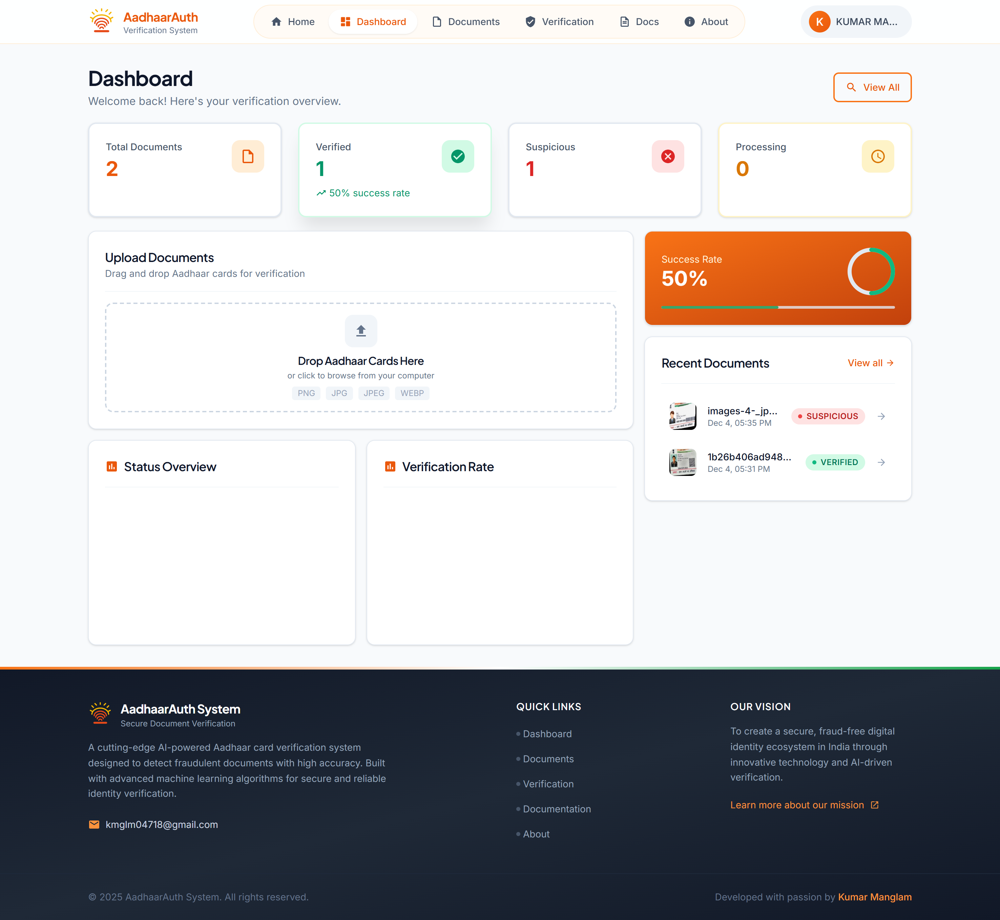
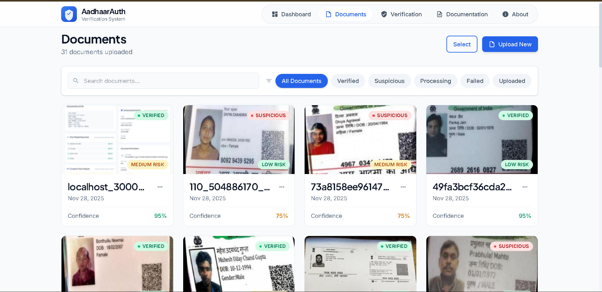
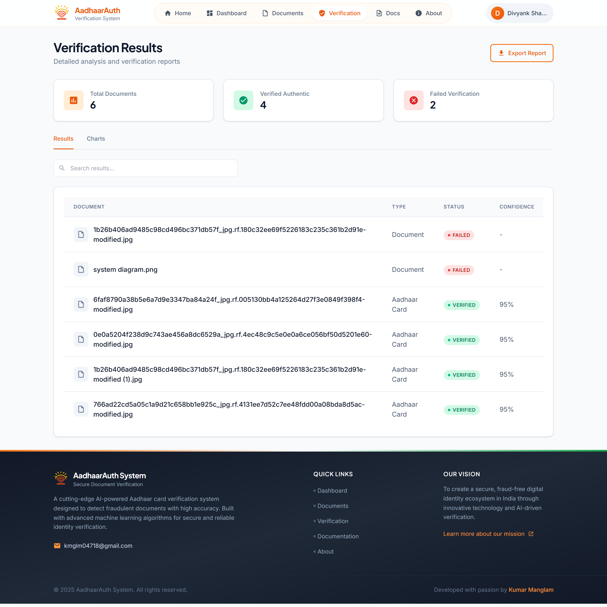
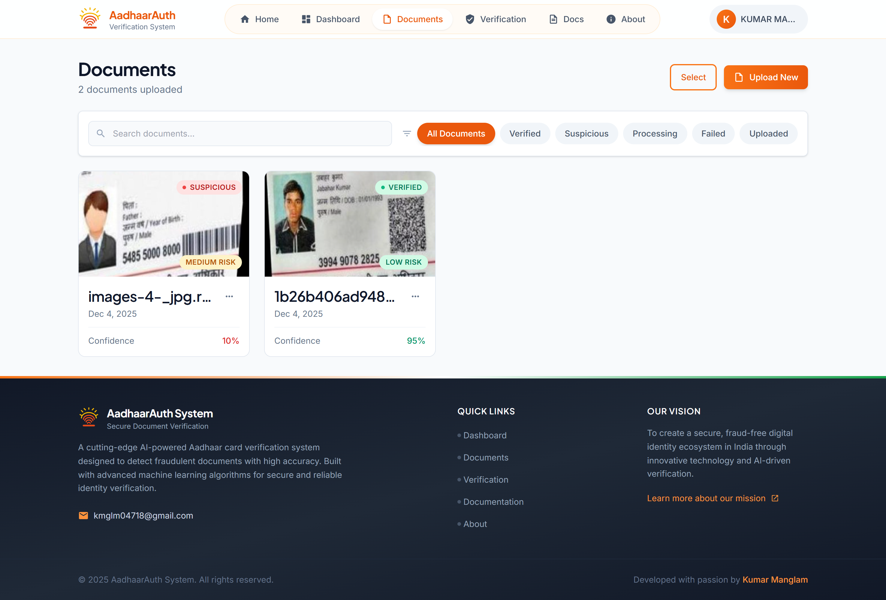
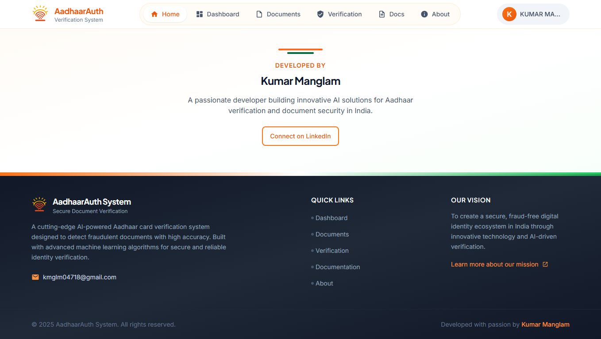

<div align="center">

# AadhaarAuth System

### AI-Powered Aadhaar Document Verification & Fraud Detection Platform


</div>

---

## Overview

**AadhaarAuth System** is a comprehensive AI-powered document verification platform designed to detect fraudulent Aadhaar cards and ensure authentic identity verification. The system combines **Google Gemini 2.0 Flash** for intelligent OCR and document analysis with **YOLOv8** deep learning models for advanced fraud detection, along with computer vision techniques to identify document tampering, photo overlays, and text alterations.

---

## Screenshots

### Dashboard
The main dashboard provides real-time statistics, document upload functionality, and quick access to all features.



### Document Analysis
Detailed analysis view showing extracted Aadhaar information, fraud detection results, and verification status.



### Verification Results
Comprehensive verification results page with accept/reject status, fraud indicators, and export capabilities.



### Documentation
Built-in documentation page for API reference and usage guidelines.



### Developer
Project developed by Kumar Manglam.



---

## Key Features

### Document Processing
- **Drag-and-Drop Upload** - Intuitive interface for single or batch document upload
- **Image Preprocessing** - Automatic quality enhancement, resizing, and thumbnail generation
- **Format Support** - Handles JPEG, PNG, and various image formats

### AI-Powered Analysis
- **Gemini 2.0 Flash OCR** - Intelligent text extraction with context understanding
- **Field Extraction** - Automatic extraction of Aadhaar number, name, DOB, gender, and address
- **Dual Format Recognition** - Supports both physical PVC cards and e-Aadhaar printouts

### Fraud Detection
- **YOLOv8 Object Detection** - Deep learning model trained to detect tampering indicators
- **Computer Vision Analysis** - Compression artifact detection, copy-paste analysis, noise pattern analysis
- **Verhoeff Checksum** - Mathematical validation of 12-digit Aadhaar numbers
- **Risk Scoring** - Comprehensive risk assessment with low/medium/high classification

### User Authentication
- **JWT Authentication** - Secure token-based user authentication
- **User-Scoped Documents** - Each user's documents are isolated and protected
- **Permission-Based Access** - Role-based access control for API endpoints

### Data Export
- **Excel Export** - Download verification results with all Aadhaar details and fraud analysis
- **CSV/JSON Export** - Export extracted data in multiple formats
- **Batch Processing** - Analyze and export multiple documents simultaneously

---

## Technology Stack

### Backend
| Technology | Purpose |
|------------|---------|
| **Django 5.0.1** | Web framework |
| **Django REST Framework** | RESTful API |
| **Google Generative AI** | Gemini 2.0 Flash integration |
| **Ultralytics YOLOv8** | Object detection & fraud analysis |
| **OpenCV** | Computer vision analysis |
| **Pillow** | Image preprocessing |
| **PyJWT** | JWT authentication |
| **openpyxl** | Excel file generation |

### Frontend
| Technology | Purpose |
|------------|---------|
| **React 19.2.0** | UI framework |
| **TailwindCSS 3.4.1** | Utility-first styling |
| **Framer Motion** | Animations & transitions |
| **Axios** | HTTP client |
| **Recharts** | Data visualization |
| **React Router 7** | Client-side routing |
| **Headless UI** | Accessible components |

---

## Project Structure

```
AadhaarAuth System/
├── backend/
│   ├── aadhaar_system/           # Django project settings
│   │   ├── settings.py           # Configuration
│   │   ├── urls.py               # Main URL routing
│   │   └── wsgi.py               # WSGI entry point
│   ├── documents/                # Main application
│   │   ├── models.py             # Database models
│   │   ├── views.py              # REST API endpoints
│   │   ├── serializers.py        # DRF serializers
│   │   ├── fraud_detector.py     # YOLO & CV fraud detection
│   │   ├── gemini_service.py     # Gemini AI integration
│   │   ├── preprocessing.py      # Image preprocessing
│   │   └── verhoeff.py           # Aadhaar checksum validation
│   ├── models/                   # Trained ML models
│   │   └── aadhaar_fraud_detector.pt
│   ├── media/                    # Uploaded files
│   │   ├── raw/                  # Original uploads
│   │   ├── processed/            # Preprocessed images
│   │   └── thumbnails/           # Preview images
│   └── requirements.txt          # Python dependencies
├── frontend/
│   ├── src/
│   │   ├── components/           # Reusable UI components
│   │   ├── pages/                # Page components
│   │   ├── services/             # API client
│   │   ├── contexts/             # React contexts
│   │   └── styles/               # CSS & Tailwind config
│   └── package.json              # Node.js dependencies
├── train/
│   └── notebooks/                # YOLO training notebooks
│       └── aadhaar_fraud_detection_yolo.ipynb
├── datasets/                     # Training datasets
│   ├── train/
│   ├── valid/
│   └── test/
└── assets/                       # Documentation screenshots
```

---

## Installation

### Prerequisites
- Python 3.8+
- Node.js 16+
- npm or yarn
- Google Gemini API key

### Backend Setup

```powershell
# Navigate to project directory
cd "AadhaarAuth System"

# Create and activate virtual environment
python -m venv venv
.cd\venv\Scripts\activate

# Install dependencies
cd backend
pip install -r requirements.txt

# Configure environment variables
# Create backend/.env file with:
# GEMINI_API_KEY=your_api_key
# DEBUG=True
# SECRET_KEY=your_secret_key

# Run migrations
python manage.py makemigrations
python manage.py migrate

# Create superuser (optional)
python manage.py createsuperuser

# Start development server
python manage.py runserver
```

### Frontend Setup

```powershell
# Open new terminal
cd "AadhaarAuth System/frontend"

# Install dependencies
npm install

# Start development server
npm start
```

### Access Points
- **Frontend**: http://localhost:3000
- **Backend API**: http://localhost:8000/api/
- **Admin Panel**: http://localhost:8000/admin/

---

## API Reference

### Authentication

| Method | Endpoint | Description |
|--------|----------|-------------|
| POST | `/api/token/` | Obtain JWT token pair |
| POST | `/api/token/refresh/` | Refresh access token |
| POST | `/api/register/` | Register new user |

### Document Operations

| Method | Endpoint | Description |
|--------|----------|-------------|
| POST | `/api/documents/upload/` | Upload documents (single/batch) |
| GET | `/api/documents/` | List user's documents |
| GET | `/api/documents/{id}/` | Get document details |
| POST | `/api/documents/{id}/analyze/` | Trigger AI analysis |
| DELETE | `/api/documents/{id}/` | Delete document |

### Batch Operations

| Method | Endpoint | Description |
|--------|----------|-------------|
| POST | `/api/documents/batch_analyze/` | Analyze multiple documents |
| POST | `/api/documents/batch_delete/` | Delete multiple documents |
| GET | `/api/documents/batches/` | List all batches |
| GET | `/api/documents/batch_documents/` | Get documents by batch |

### Verification & Export

| Method | Endpoint | Description |
|--------|----------|-------------|
| GET | `/api/documents/verification_results/` | Get verification statistics |
| GET | `/api/documents/export_excel/` | Export results to Excel |
| GET | `/api/documents/export_extracted_data/` | Export data (CSV/JSON/Excel) |
| GET | `/api/documents/fraud_analysis/` | Get detailed fraud analysis |

---

## Fraud Detection Pipeline

### 1. Gemini AI Analysis
- Performs intelligent OCR with context understanding
- Extracts structured data (Aadhaar number, name, DOB, gender, address)
- Identifies document format (physical card vs e-Aadhaar)
- Validates design compliance (Ashoka emblem, govt text, QR code)

### 2. Aadhaar Number Validation
```
Step 1: Length Check      → Must be exactly 12 digits
Step 2: First Digit Check → Must be 2-9 (not 0 or 1)
Step 3: Regex Validation  → Pattern: ^[2-9][0-9]{11}$
Step 4: Verhoeff Checksum → Mathematical validation algorithm
```

### 3. YOLOv8 Object Detection
Trained to detect:
- Aadhaar number region
- Photo region
- QR code region
- Name field
- Address field
- Signs of tampering

### 4. Computer Vision Analysis
| Analysis | Detection |
|----------|-----------|
| Compression Artifacts | JPEG manipulation indicators |
| Copy-Paste Detection | Cloned regions using ORB features |
| Noise Pattern Analysis | Inconsistent noise variance |
| Edge Analysis | Suspicious edge density patterns |
| Text Region Analysis | Font inconsistencies |

### 5. Risk Scoring
```
Risk Level: LOW     → Score < 0.3
Risk Level: MEDIUM  → Score 0.3 - 0.6
Risk Level: HIGH    → Score > 0.6
```

---

## Database Schema

### AadhaarDocument
| Field | Type | Description |
|-------|------|-------------|
| `user` | ForeignKey | Document owner |
| `original_file` | ImageField | Original uploaded image |
| `preprocessed_file` | ImageField | Enhanced image |
| `thumbnail` | ImageField | Preview image |
| `file_name` | CharField | Original filename |
| `file_size` | IntegerField | Size in bytes |
| `status` | CharField | uploaded/processing/completed/failed |
| `batch_id` | CharField | Batch grouping ID |

### DocumentMetadata
| Field | Type | Description |
|-------|------|-------------|
| `document` | OneToOneField | Related document |
| `full_text` | TextField | Complete OCR text |
| `aadhaar_number` | CharField | Extracted 12-digit number |
| `name` | CharField | Extracted name |
| `date_of_birth` | CharField | Extracted DOB |
| `gender` | CharField | Extracted gender |
| `address` | TextField | Extracted address |
| `confidence_score` | FloatField | AI confidence (0-1) |
| `is_authentic` | BooleanField | Verification result |
| `fraud_indicators` | JSONField | List of fraud signs |
| `fraud_detection` | JSONField | YOLO & CV analysis results |

---

## Training Custom Models

### Dataset Structure
```
datasets/
├── train/
│   ├── images/
│   └── labels/
├── valid/
│   ├── images/
│   └── labels/
└── test/
    ├── images/
    └── labels/
```

### Training on Google Colab
1. Upload dataset to Google Drive
2. Open `train/notebooks/aadhaar_fraud_detection_yolo.ipynb` in Colab
3. Enable GPU runtime (T4 recommended)
4. Update dataset path and run training
5. Download `best.pt` and place in `backend/models/`

### Model Classes
| Class ID | Detection Target |
|----------|-----------------|
| 0 | Aadhaar Number Region |
| 1 | Photo Region |
| 2 | QR Code Region |
| 3 | Name Field |
| 4 | Address Field |

---

## Security Considerations

> **Warning**: The default configuration is for development only.

### Production Checklist
- [ ] Change `SECRET_KEY` to a secure random value
- [ ] Set `DEBUG=False`
- [ ] Use PostgreSQL instead of SQLite
- [ ] Configure HTTPS/SSL
- [ ] Store API keys in secure vault
- [ ] Implement rate limiting
- [ ] Enable CORS only for specific domains
- [ ] Encrypt media files at rest
- [ ] Set up proper logging and monitoring

---

## Troubleshooting

### Backend Issues
```powershell
# Virtual environment not activated
.\venv\Scripts\activate

# Database errors
python manage.py makemigrations
python manage.py migrate

# Missing dependencies
pip install -r requirements.txt
```

### Frontend Issues
```powershell
# Clear cache and reinstall
rm -rf node_modules
npm install

# Port already in use
# Change port in package.json or kill existing process
```

### Common Errors
| Error | Solution |
|-------|----------|
| CORS errors | Check `CORS_ALLOWED_ORIGINS` in settings.py |
| Gemini API errors | Verify API key and quota |
| YOLO model errors | Ensure model file exists in `backend/models/` |
| Upload fails | Check media folder permissions |

---

## Designed & Developed By

<div align="center">

**Kumar Manglam**

A passionate developer dedicated to building innovative solutions that make a real difference in people's lives.

[](https://www.linkedin.com/in/kumar-manglam18/)
[](https://github.com/KManglam/)
[](mailto:kmglm04718@gmail.com)

</div>

---

## License

This project is licensed under the **MIT License** - see the [LICENSE](LICENSE) file for details.

Copyright (c) 2025 Vidzai Digital

---

<div align="center">

**AadhaarAuth System** - Securing India's Digital Identity

</div>
